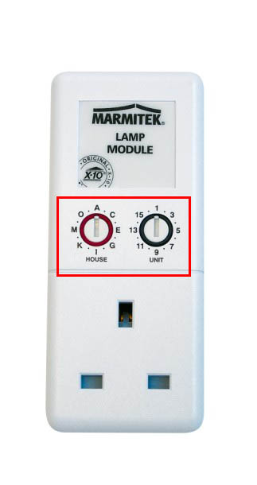

# cs-active-home-x10

A .NET wrapper library for controlling ActiveHome X10 appliance.

# Install

In order for the cs-active-home-x10 to work, you need to install the ahsdk_install.exe first (which can be found in the Libs folder of this project as well) first. Next run the following nuget command
with your .net project.

```bash
Install-Package cs-active-home-x10 -Version 1.0.1
```

To test out you need to have the an X10 device (for example, the LM12U shown below) connected to your home appliance (say a lamp), and then configure its address using the pins on the LM12U.

.

Next you can run the cs-active-home-x10-samples-winforms project by entering the lamp address on the WinForm UI launched (say "A1"). Now you can turn on or off your lamp by clicking the button on the WinForm UI.

# Usage

The source code belows shows how to control X10 appliance (say a lamp) via the PLC

```cs
ActiveHomeController.Instance.RecvAction += (sender, e) =>
	{
		String strMsg = "";
		ActiveHomeRecvResult result = e.Result;
		string strAction = result.ResultActionType;
		

		if (strAction.ToUpper() == "RECVPLC")
			strMsg += "Recieved Powerline Command:";

		strMsg += " " + result.Address.ToUpper();
		strMsg += " " + result.Command.ToUpper();

		if (result.Reserved1.Length > 0)
			strMsg += " " + result.Reserved1.ToUpper();

		if (result.Reserved2.Length > 0)
			strMsg += " " + result.Reserved2.ToUpper();

		if (result.Reserved3.Length > 0)
			strMsg += " " + result.Reserved3.ToUpper();
		

		Console.WriteLine(strMsg);
	};

string lampAddress = "A1";
Console.WriteLine(ActiveHomeController.Instance.TurnOn_PLC(lampAddress));

ActiveHomeDeviceStatus status_code = ActiveHomeController.Instance.Query_PLC(lampAddress);

if (status_code == ActiveHomeDeviceStatus.OFF)
{
	Console.WriteLine(lampAddress + " is OFF");
}
else if (status_code == ActiveHomeDeviceStatus.ON)
{
	Console.WriteLine(lampAddress + " is ON");
}

Console.WriteLine(ActiveHomeController.Instance.TurnOff_PLC(lampAddress));

```

