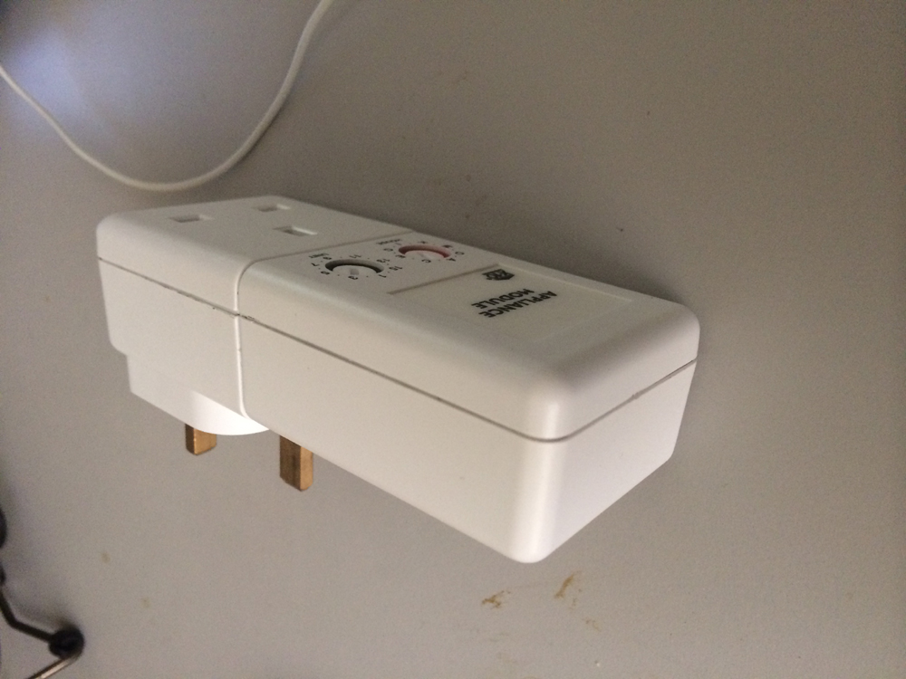

# cs-active-home-x10

A .NET wrapper library for controlling ActiveHome X10 appliance (The X10  is )

# Install

```bash
Install-Package cs-active-home-x10 -Version 1.0.1
```

# Usage

The source code belows shows how to control X10 appliance (say a lamp) via the PLC

```cs
ActiveHomeController.Instance.RecvAction += (sender, e) =>
	{
		String strMsg = "";
		ActiveHomeRecvResult result = e.Result;
		string strAction = result.ResultActionType;
		

		if (strAction.ToUpper() == "RECVPLC")
			strMsg += "Recieved Powerline Command:";

		strMsg += " " + result.Address.ToUpper();
		strMsg += " " + result.Command.ToUpper();

		if (result.Reserved1.Length > 0)
			strMsg += " " + result.Reserved1.ToUpper();

		if (result.Reserved2.Length > 0)
			strMsg += " " + result.Reserved2.ToUpper();

		if (result.Reserved3.Length > 0)
			strMsg += " " + result.Reserved3.ToUpper();
		

		Console.WriteLine(strMsg);
	};

string lampAddress = "A1";
Console.WriteLine(ActiveHomeController.Instance.TurnOn_PLC(lampAddress));

ActiveHomeDeviceStatus status_code = ActiveHomeController.Instance.Query_PLC(lampAddress);

if (status_code == ActiveHomeDeviceStatus.OFF)
{
	Console.WriteLine(lampAddress + " is OFF");
}
else if (status_code == ActiveHomeDeviceStatus.ON)
{
	Console.WriteLine(lampAddress + " is ON");
}

Console.WriteLine(ActiveHomeController.Instance.TurnOff_PLC(lampAddress));

```

# Hardware

Below is the showing how to configure the "A1" address for the LM12U X10 switch which connect (say a lamp) to the PLC socket (like a power adapter)



